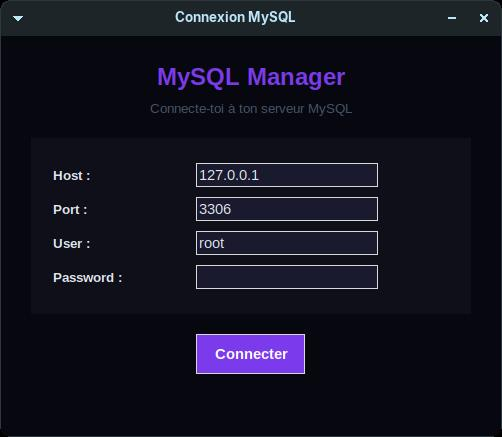
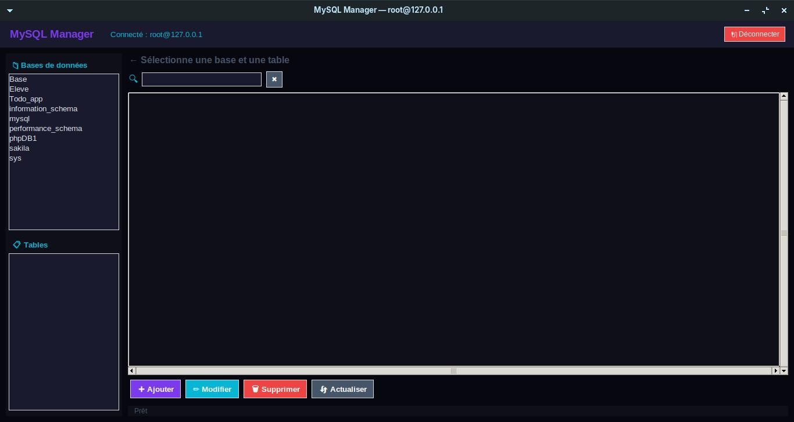

# 🗄️ MySQL Manager

Gestionnaire MySQL universel avec interface graphique Python Tkinter.

## 📸 Aperçu



## Fonctionnalités
- 🔌 Connexion à n'importe quel serveur MySQL
- 📁 Exploration des bases de données et tables
- 📋 Visualisation des données
- ➕ Ajouter des lignes
- ✏️ Modifier des lignes
- 🗑 Supprimer des lignes
- 🔍 Recherche en temps réel

## Technologies
- Python 3 + Tkinter
- mysql-connector-python

## Installation
```bash
git clone https://github.com/ralijaonafehizoro961-wq/Mysql-manager
cd Mysql-manager
pip3 install mysql-connector-python
python3 main.py
```

## Auteur
Fehizoro RALIJAONA🇲🇬